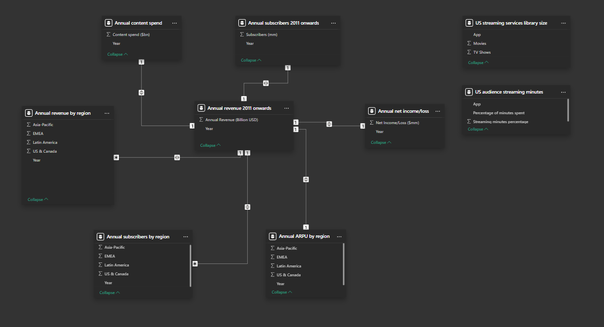

# Netflix Revenue and Usage Statistics Analysis

## Overview
This project is focused on analyzing Netflix's financial data and usage statistics using a dataset sourced from Kaggle. The main objective is to explore key metrics such as annual revenue, subscriber growth, content spend, and ARPU (Average Revenue Per User) to derive business insights. The analysis is done using **Power BI** for data cleaning, transformation, and visual exploration. 

The project serves as an important addition to my **Business Intelligence** and **Data Analytics** portfolio, showcasing end-to-end BI project skills, from data cleaning to future predictive analysis and visualization.

## Dataset

The dataset used in this project is sourced from **Kaggle** and contains various sheets with Netflix's financial and subscriber data:

- **Annual revenue** (2011 onward)
- **Revenue by region** (US & Canada, EMEA, Latin America, Asia-Pacific)
- **ARPU (Average Revenue Per User)** by region
- **Content spend**
- **Net income/loss**
- **Subscribers by region**
- **US audience streaming minutes** vs other streaming platforms

**Source**: [Netflix Revenue and Usage Statistics - Kaggle](https://www.kaggle.com](https://www.kaggle.com/datasets/adnananam/netflix-revenue-and-usage-statistics?phase=FinishSSORegistration&returnUrl=%2Fdatasets%2Fadnananam%2Fnetflix-revenue-and-usage-statistics%2Fversions%2F1%3Fresource%3Ddownload&SSORegistrationToken=CfDJ8CXYA35d3CRDujxBNSrCTMshKNYZ2552CvxyDiuIBev5HXla8rW--65oVGqP--EMYP_SuZAbvBHc8KleKetsKUFGq3fzCRT3D2BSmEeT9u8YxQ4delJXEvFRnDhoCn4uh3YhhsJaD12WerjXU48_xj4t2TaA4gm5GQGpo18MZCcTgT6qLC5cxczkp7FgVz8JUhMEMh099SYzgv2btotdUWrTIRKyhFh9czKBwO0FSIqGJuUElt8g9-lNb15r1MzObjeJV-DR_u8T4_CGFQjRP7wzsiNDr-UMK3SUw-wprFfU86O5eshWlxGZmeLiEGhdp41STdAgKxWK7Yfm2OXPtGlZqPivK0ds3wQ&DisplayName=Eshita+Kundu)

## Completed Steps

### 1. **Data Cleaning and Preparation in Power BI**
- Cleaned and prepared the dataset for analysis using **Power BI**.
- Adjusted data types (e.g., converting `Year` to whole numbers).
- Cleaned the `Percentage of Streaming Minutes` column by adjusting its format to display as a percentage correctly.

### 2. **Renaming Columns**
- Renamed columns to ensure clarity and consistency for easier analysis. For example:
  - `Revenue ($bn)` renamed to `Annual Revenue (Billion USD)`
  - `Date` renamed to `Year`
  - Region names in different sheets were clarified.

### 3. **Mapping Relationships Between Tables**
- Mapped relationships between various sheets using **Year** as the common key.
  - One-to-many and one-to-one relationships were set between the `Year` column in the primary table (Netflix Annual Revenue) and other tables (e.g., ARPU by region, subscribers by region).
Below is the relationship mapping between the different datasets used for the analysis:
 

### 4. **Exploratory Analysis**
- Initial exploration of key metrics like revenue trends, subscribers by region, and content spend.
- Insights gathered include:
  - Annual revenue growth over time.
  - Regional contribution to revenue.
  - Subscriber growth across different regions.

## Files in the Repository

### 1. **data/Netflix-Revenue-and-Usage-Statistics.xlsx**
   The original dataset sourced from Kaggle, containing all sheets related to Netflix's financial performance.

### 2. **powerbi/Netflix-Revenue-Analysis.pbix**
   This file contains the cleaned and transformed data within Power BI. It includes:

### 3. **README.md**
   A detailed project documentation that outlines the objectives, steps taken, files included, and the roadmap for further progress.

## Future Steps

- **Interactive Visualizations**: 
  - Create detailed dashboards in Power BI showcasing key metrics such as revenue by region, subscriber growth, ARPU, and content spend.
  - Design a custom background using **Figma** to make the dashboard visually appealing.

- **Predictive Analysis**:
  - Implement forecasting models to predict future subscriber growth and revenue using built-in Power BI forecasting tools and potentially Python or R for more advanced modeling.

## How to Run

1. **Power BI**: 
   - Open the `Netflix-Revenue-Analysis.pbix` file in Power BI to view the data cleaning steps and initial exploration.
   
2. **Further Development**: 
   - Explore the dataset and use Power BI to continue creating visualizations, reports, and dashboards.
